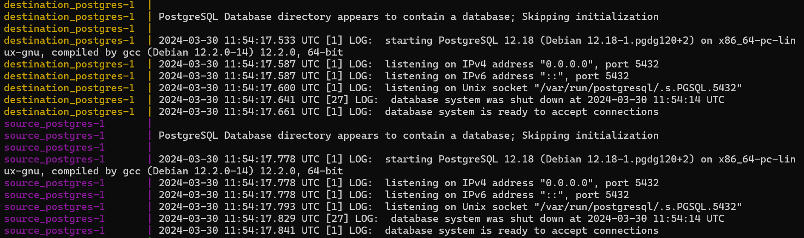

# Data engineering Pipeline
## Table of contents
- [Introduction](#introduction)
- [How it works/Repository Structure](#how-it-worksrepository-structure)
- [Dependencies](#dependencies)
- [Getting Started](#getting-started)
- [Source](#source)

## Introduction
This exercise takes data from one source folder and moves it across to a destination folder. <br>

### Tools and their uses
- A `CRON` job: A `.sh` file to run the pipeline at a specific time. This is in essence a less detailed version of what airflow will do. But good to learn none-the-less since companies do use these.  <br>
- `Airflow` for scheduling of the pipeline. Using DAGs (Directed Acyclic Graphics). This will help us run the pipeline on a schedule automatically.  <br>
- `dbt` (data build tool) on top of the destination data for transformations to the data. Focusing on models and macros, but dbt can also run tests on the transformation for a robust pipeline <br> 

## How it works/Repository Structure
1. docker-compose.yaml: This file contains the configuration for Docker Compose, which is used to orchestrate multiple Docker containers. It defines three services: <br>
i. `source_postgres:` The source PostgreSQL database with sample data. <br>
ii. `destination_postgres:` The destination PostgreSQL database where the pipeline will dump data. <br>
iii. `elt_script.py:` The service that runs the ELT script, in a python envionment. The elt_script.py waits for the source PostgreSQL database to become available. Once it's available, the script uses pg_dump to dump the source database to a SQL file. Then, it uses psql to load this SQL file into the destination PostgreSQL database.<br>
2. `elt_script/Dockerfile:` This Dockerfile sets up a Python environment and installs the PostgreSQL client. It also copies the ELT script into the container and sets it as the default command. <br>
3. `elt_script/elt_script.py:` This Python script performs the ELT process. It waits for the source PostgreSQL database to become available, then dumps its data to a SQL file and loads this data into the destination PostgreSQL database. <br>
4. `source_db_init/init.sql:` This SQL script initializes the source database with sample data. It creates tables for users, films, film categories, actors, and film actors, and inserts sample data into these tables. <br>

## Dependencies:
1. Docker Desktop and Docker Compose <br>
2. Airflow from Docker <br>
3. DBT downloaded through Python's pip. <br> 
i. Make sure there is a `.dbt ` folder in the home directory; where the profiles.yml file will reside <br>
```$ mkdir $home\.dbt```
<br>
ii. I downloaded/installed dbt in a virtual environment (dbt-env) created in the main folder (FolderA)
```
python -m pip venv dbt_env            # to create the virtual environment (venv)
.\dbt_env\Scripts\activate.bat        # to activate the venv
python -m pip install dbt-postgres    # to install dbt in the venv, this will add a dbt.exe in Scripts folder of the venv
dbt init                              # since we have the dbt.exe in the scripts folder we can run this using CLI
```
<br>
iii. For first time user no profile.yml file exists. So dbt will ask everything in terminal to create one. From next time onward the file can be edited for adding/deleting projects. <br>
For Windows use
`notepad $home/.dbt/profiles.yml` <br>
Information asked will be: <br>

```
Enter a number: 1
host (hostname for the instance): host.docker.internal
port [5432]: 5434
user (dev username): postgres
pass (dev password):
dbname (default database that dbt will build objects in): destination_db
schema (default schema that dbt will build objects in): public
threads (1 or more) [1]: 1
``` 
iv. In the dbt's project folder, open the file `dbt_project.yml` and change `+materialized` to `table` from `view`. Materialization is a variable that controls how dbt creates a model, wfor this purpose we want to use our tables. <br>
v. In the models folder, add sources/references `actors.sql`, `film_actors.sql`, `films.sql` and then define the schema from `schema.yml`. The schema file is useful in testing. When dbt runs the test it will use this file as reference and if the schema does not match throw errors

## Getting Started
Either clone the respository and start `docker-compose up` <br>
OR <br>
    - Create a folderA <br>
    - Create Docker-compose.yaml <br>
    - Inside folderA create Folder called "elt" and add Dockerfile and elt_script.py in it. <br>
    - Navigate to FolderA using terminal and run  `docker-compose up`
<br>
Once all containers are up and running, the ELT process will start automatically. <br>
After the ELT process completes, you can access the source and destination PostgreSQL databases on ports 5433 and 5434, respectively. <br>


## Screenshots of the working exercise


## Limitations of this exercise
- This exercise is very basic. Most real life jobs will not require moving data from one folder to another on-prem.
- This exercise uses a varitation of batch system. But in most cases data will be too big to for this to work efficently.
    - The way to improve upon this exercise is to add cloud services and more open source tools a batch processing using "Spark" and Stream processings using "Kafka"

## Source
    https://www.youtube.com/watch?v=PHsC_t0j1dU&list=WL&index=14&ab_channel=freeCodeCamp.org